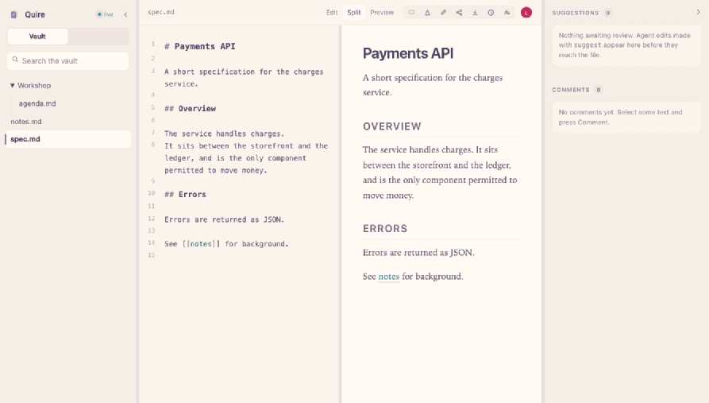

# Quire

**Google Docs for Markdown — where the files stay yours, and one of the collaborators is an agent.**

Point Quire at a folder of Markdown. It becomes a live multiplayer workspace, and AI agents
can join editing sessions as first-class collaborators with visible cursors and separately
revertable edits. Your documents stay plain `.md` files on disk, in your git repo, owned by you.



*Recorded against the real application. A person types while an agent edits the same document,
proposes a change that never touches the file until it is accepted, and then authorship is
revealed. Nobody reloads, and nothing conflicts.*

```bash
npm install && npm run build
node packages/cli/bin/quire.js ~/my-notes
```

No account. No signup. Binds `127.0.0.1` by default. Quire touches the network only in Discover,
and only when you ask it to — `--no-search` or `--no-discover` remove even that.

## Where it sits

Plenty of tools do two of these. Quire is the one that does all three.

| | Multiplayer | Agent-native | Plain files |
|---|:---:|:---:|:---:|
| Notion · Outline · Docmost · HedgeDoc | ✅ | ❌ | ❌ |
| Obsidian · SilverBullet · Logseq | ❌ | ~ | ✅ |
| [SoloMD](https://github.com/zhitongblog/solomd) | ❌ | ✅ | ✅ |
| [CollabMD](https://github.com/andes90/collabmd) | ✅ | ❌ | ✅ |
| **Quire** | ✅ | ✅ | ✅ |

The difference that matters: in Quire the agent is a peer in the *same CRDT session* you are typing
in — visible cursor, attributed spans, separately revertable — rather than a batch process whose
diff you read afterwards.

## What works today

| | |
|---|---|
| **Live co-editing** | Multiple browsers on one file, remote cursors and selections, offline-tolerant reconnect |
| **Plain files** | The filesystem is the source of truth. Edit in vim or `git pull` mid-session and it merges as a delta, not an overwrite |
| **Agents as peers** | An MCP endpoint lets Claude Code (or any MCP client) join the *same CRDT session* — not rewrite files behind your back |
| **Attribution** | Every span carries its author. Toggle **Authors** to tint text by who wrote it |
| **Suggest mode** | Agent edits can be proposed rather than applied. They show inline, and never reach disk until accepted |
| **Revert by author** | Remove one agent's contributions without touching the paragraph you wrote beside them |
| **Comments** | Anchored to text ranges, survive concurrent edits, and are flagged rather than dropped when their anchor is deleted |
| **Wiki-links** | `[[links]]`, backlinks panel, unresolved links flagged |
| **Search** | ripgrep-backed, with an in-process fallback |
| **Mermaid** | Rendered in the live preview |
| **Git snapshots** | Periodic commits on quiet. Git is the archive, never the transport |
| **Discover** | Browse widely-used Markdown — agent configs, skills, conventions — and add it to your vault with provenance recorded. An index, not a host: files come from their own repositories |
| **Live updates** | Files created by an agent, by Discover, or by another tool appear immediately |
| **Suggesting mode** | People get the same suggest mode agents have. Your edits become proposals and stay off disk until accepted |
| **Share links** | Capability links scoped to a file or the vault, with view / comment / edit. View is enforced server-side |
| **Export** | Markdown, self-contained HTML, plain text, copy-with-formatting for pasting into Docs, and print or save as PDF |
| **Typography** | Prose and editor typefaces, size, leading, measure, theme, and a focus mode. Display only — never a byte of the file |
| **GitHub search** | Search GitHub from Discover for anything the curated index misses, then pick which Markdown file to bring across |
| **Adjustable panels** | Drag any divider, double-click to reset. Each panel closes from its own corner and leaves a stub to reopen it — sidebar (Cmd+\), source (Cmd+Shift+E), comments (Cmd+Shift+\). Sizes persist |

## Connecting an agent

Run the vault, then point any MCP client at it:

```bash
node packages/mcp/bin/quire-mcp.js --url http://127.0.0.1:4321 --name Claude
```

Tools: `list_documents`, `read_document`, `edit_document` (with `suggest`), `append_document`,
`list_suggestions`, `list_comments`, `add_comment`, `search_vault`.

The agent gets a presence identity and a cursor. You can type straight through its edits —
CRDTs make that a non-event.

## Security

Binds `127.0.0.1`, serves only its own origin, and refuses cross-origin requests so a web page you
happen to have open cannot reach your vault. No telemetry, no accounts, nothing leaves the machine.
**There is no authentication**, so treat `--host 0.0.0.0` as "anyone who can reach this port can
edit everything". See [SECURITY.md](./SECURITY.md).

## Self-hosting

```bash
docker compose up --build
```

## Documents

| File | What's in it |
|---|---|
| **[PLAN.md](./PLAN.md)** | Execution plan, locked decisions, phases, outcomes, risks |
| [DESIGN.md](./DESIGN.md) | Competitive landscape, architecture, the hard problems |
| [BUSINESS.md](./BUSINESS.md) | Cost math, deployment, funding paths |
| [MARKETING.md](./MARKETING.md) | Positioning, launch sequence, what to measure |
| [DEPLOYMENT.md](./DEPLOYMENT.md) | How this reaches people, and what each route costs |
| [IDEAS.md](./IDEAS.md) | Speculative features worth building, and what to avoid |
| [CONTRIBUTING.md](./CONTRIBUTING.md) | Architecture invariants — read before a large PR |
| [SECURITY.md](./SECURITY.md) | Threat model and known limitations |
| [tools/recorder](./tools/recorder) | Regenerates `docs/demo.gif` from the real app |

## Licence

AGPL-3.0-or-later for the server; the client SDK and MCP adapter are permissive.
